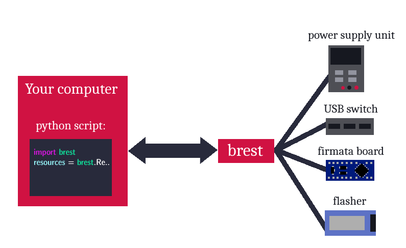

.. _intro:

Intro
=====

What is Brest?
--------------

Brest (Bender Robotics Embedded Systems Toolkit) is a python package that acts as a gateway between high level code and physical devices. It does that by incorporating an API for automating USB or COM port connections.
Developed by `Bender Robotics`_, it is used in automated testing of embedded systems under development, where devices such as programmable power supply units, USB switches, serial communication converters etc. are needed.

Writing a basic YAML :ref:`definitions.configuration-file` lets you create all needed devices as python objects with a few lines of code, providing you with a variety of functions, making automation very easy to implement.

.. _Bender Robotics: https://www.benderrobotics.com/

Simple usage diagram:

|

Brest also contains structures for assigning created devices to your python Test Suites, making it ideal for implementing Hardware-in-the-loop testing.

Here you can see the list of :ref:`supported` or start using Brest in the :ref:`installation` section.
