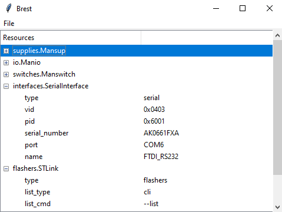

.. _usage:

Usage
=====

Eager to get started? This page gives a good introduction to Brest. It assumes you already have
Brest installed. If you do not, head over to the :ref:`installation` section.

Interactive mode
----------------
A minimal thing you have to do, is to import Brest.

.. code-block:: sh

    >>> import brest

Now you can instantiate :class:`~brest.ResourceProvider` to get a interface to resource managing::

    >>> rp = brest.ResourceProvider()

Using :meth:`~brest.ResourceProvider.print_available` method will print connected resources known
by Brest. You can use ``group`` argument to list only required group of resources. To get a list
of available groups, please refer to the :ref:`supported`. If nothing is provided, all available
resources will be listed::

    >>> rp.print_available()
    [0] Tenma
        type: serial
        timeout: 0.1
        vid: 1046
        pid: 20497
        serial_number: A02014090305
        port: COM9

The number in square bracket indicate resource index in resource list obtained from
:meth:`~brest.ResourceProvider.available`. Following string represents a name of the class,
that can be constructed using interface parameters listed on the next lines. To get more information
about interface parameters please refer to the :ref:`definitions.interfaces`.

The next step is to instantiate a selected resource. You can do that using
:meth:`~brest.ResourceProvider.construct_available` method. For example, if I want to instantiate the
Tenma supply from previous example::

    >>> psu = rp.construct_available(0)

Only thing you have to do is to pass the desired resource's index and resource provider will construct the
object for you.
If you have printed resources using ``group`` parameter, you also need to specify the same group to
:meth:`~brest.ResourceProvider.available` method for corresponding indexes.

Now, you have the bench power supply ready to operate through the `psu` variable which contains
:class:`~brest.Tenma` class as an unified interface::

    >>> psu.voltage = 40
    >>> psu.enable()
    >>> psu.voltage
    40
    >>> psu.current
    0.032

Configuration file
------------------

If you have resources set up on your desk that won't change anytime soon, you can describe it
using a configuration file. To get the glimpse of how to write a configuration file, please refer
to :ref:`definitions.configuration-file`.

Brest supports two configuration files. The first configuration file is user specific and is
located in :attr:`~brest.Config.BREST_USER_CONFIG_DIR`. If you want to have it in another
location, you can specify absolute path using ``user_config=`` keyword argument.

The second configuration file is project specific. This configuration file is not mandatory
and its location can be specified using absolute path passed to ``project_config=`` keyword argument.
This config will be merged with user specific config. User config overrides and adds items to
project specific config.

The first parameter ``project`` indicate what project you want to use from configuration file.

After you have created your configuration file, you can use it in Brest by instancing the
:class:`~brest.Resources` class::

    import brest

    res = brest.Resources('myProj')

If you have any custom classes which derived from any Brest’s base classes, you also have to
import them so Brest can get to know them.

If you don't want to use every resource defined in the configuration file, you don't have to
create a new configuration file or project. Just specify resource aliases in the ``needed=``
parameter as list of strings and Brest will instantiate only them.

In case of successful configuration file instantiation you should see something like this in your
command line::

    [2019-09-10 13:59:54,020][INFO] : brest.resources.Resources._instantiate() -> All resources successfully initialized
    Resources: {
        supply : <brest.supplies.tenma.Tenma object at 0x03006890>
    }

Now you can access created class using `[]` operator and resource alias as a key::

    res['supply'].voltage = 40

This will give you direct access to the created class.

Brest GUI
---------

Brest also comes bundled with a simple GUI based application, which is copied to the scripts folder during package installation. This GUI can be used to monitor :ref:`devices supported by Brest<supported>` that are currently connected to the computer in real time.

|

Current features
~~~~~~~~~~~~~~~~

* List of the available devices auto-updates with 1 second interval.
* Devices are added to the tree-view, details of each device can be expanded or collapsed.
* Expanded view for each device shows intenral parameters.
* Every parameter can be copied to clipboard by double-clicking.
* Supported USB <-> serial converters also show their type (e.g. CP210x, FTDI).

Running
~~~~~~~

When installing Brest by pip please execute the following command from command line in order to run the GUI:

    >>> python -m brest.gui

Otherwise `brest.gui` executable should be present in your python installation script folder (next to `pip` and other scripts).

System tests
------------

Brest also can be used to help you with system tests. First, you need to create a configuration file,
if you don't know how, please refer to the :ref:`definitions.configuration-file`.

Next thing is to define `needed` resources in every test::

    import unittest

    class TestSupply(unittest.TestCase):

        # Resource aliases from the config file
        needed = ['supply', 'dut']
        # This attribute will be populated
        # with Resources object afters Brest
        # finishes test preparation
        resources = {}

        def setUp(self):
            # you can assign resources to attributes for
            # easier access
            self.psu = self.resources['supply']
            self.dut = self.resources['dut']

        def test_case(self):
            # Direct use of classes
            self.psu.enable()
            self.dut.send_message(...)
            ...

        ...

    # In a case of running a single test
    if __name__ == __main__:
        import brest

        # Construct needed resources
        resources = brest.Resources('myProj', needed=TestSupply.needed)
        # Set resources to be available in the test
        TestSupply.resources = resources

        unittest.main()

The ``needed=`` class attribute must be a list of resources aliases from the configuration
file. Last thing to get the whole thing working is to call a :meth:`~brest.helpers.prepare_tests` helper
method on discovered tests::

    main_suite = unittest.defaultTestLoader.discover('tests')
    resources = brest.prepare_tests(main_suite, 'myProj')
    result = unittest.TextTestRunner(stream=sys.stdout).run(main_suite)

Brest will browse through all discovered tests and collect needed resource for every
test, construct :class:`~brest.Resources` with ``needed`` parameter set to collected needed resources and
set it to every ``resource`` class attribute. Such code should be located in run_all_test like file.

.. admonition:: Running a single test

    If you want to run a single test, you have to instantiate configuration file. If you use ``needed`` class
    attribute as a parameter for :class:`~brest.Resources` and then created object set as ``resources``
    class attribute, the test will behave as excepted.

Examples
--------

This section shows examples of basic use of each module

Finding resource info without instantiation
~~~~~~~~~~~~~~~~~~~~~~~~~~~~~~~~~~~~~~~~~~~
If you have existing codebase you can use Brest to find additional information about connected devices described in the configuration file without instantiation of the resources.
Consider following example::

    # Resource description in e.g. project config
    myProj:
        cp:
            class_name: interfaces.SerialInterface
            interface:
                vid: 0x10C4
                pid: 0xEA60
                baudrate: 115200

You can search for resource's additional info like ``port`` by calling :meth:`~brest.find_available_resource`. Method returns a dict used for description of the resource that
corresponds with the configuration file structure. Calling::

    com = brest.find_available_resource('myProj', 'cp', project_config='../config.yaml')

in case of device being connected returns a dict containing ``class_name`` and ``interface`` extended by port. This can be used further in your existing code to create needed objects like::

    port = serial.Serial()
    port.port = com['interface']['port']
    port.baudrate = com['interface']['baudrate']
    ci = CommInterface(port)

Getting native Serial object
~~~~~~~~~~~~~~~~~~~~~~~~~~~~
If you want to get native ``serial.Serial`` object to your existing codebase instead of Brest's internal object, but also use features like config definition, consider following example::

    # Resource description in e.g. project config
    myProj:
        cp:
            class_name: interfaces.SerialInterface
            interface:
                vid: 0x10C4
                pid: 0xEA60
                baudrate: 115200

You can use Brest to create the resource using classic usage approach as creating :class:`~brest.Resources` class. Upon creating the object, you will get information about instantiation::

    Resources: {
        cp : <brest.interfaces.serial_interface.SerialInterface object at 0x03ABA050>
    }

Instantiated :class:`~brest.interfaces.SerialInterface` object have ``com`` attribute, which holds the desired ``serial.Serial`` object that has all attributes set according to your
configuration file definition. This can be used in your further in your existing code to create needed objects like::

    res = brest.Resources('myProj', project_config='../config.yaml')
    port = res['cp'].com
    ci = CommInterface(port)

Modbus interface
~~~~~~~~~~~~~~~~

Using in class
^^^^^^^^^^^^^^
Modbus interface is implemented as general interface and is meant to be inherited in your particular case. This example uses GateInterface.
Firstly you need to create class that specifies communication::

    from brest.interfaces import Interfaces
    from brest.communication import SerialCommunicable
    from brest.communication.modbus import ModbusInterface

    class GateInterface(Interfaces, ModbusInterface, SerialCommunicable):

        Interfaces.KNOWN['GateInterface'] = {
            'type': 'serial',
            'baudrate': 19200,
            'timeout': 0.1,
            'vid': 0x0403,
            'pid': 0x6001
            }

        def __init__(self, kwargs):
            Interfaces.__init__(self)
            SerialCommunicable.__init__(self, kwargs['interface'])
            ModbusInterface.__init__(self, kwargs['interface'])

        def detect_model(self):
            pass

        def _read_raw_frame(self):
            # Get blank frame
            frame = self.get_frame()

            frame.raw_data = bytearray()
            self.com.timeout = 0.2
            frame.raw_data += self.read_raw(size=1)
            self.com.timeout = 0.05

            # Receive data, should call read_until(expected='', size=None) and stop at timeout
            while True:
                received = self.read_raw(size=1)
                if (len(received) > 0) and (len(frame.raw_data) < 255):
                    frame.raw_data += received
                else:
                    break

            msg = "".join("\\0x%02x" % i for i in frame.raw_data)
            self.logger.debug('Received raw response: {}'.format(msg), extra=self.log_args)
            return frame

Class must inherit some Communicable and implement ``write`` and ``_read_raw_frame`` methods (here ``write`` from SerialCommunicable does not need to be altered)

Config file
^^^^^^^^^^^
Usage is as with other modules. Correct parameters of converter can be specified, if default ones are not sufficient::

    yourproject:
        gate_interface:
            class_name: 'interfaces.GateInterface'

Basic use
^^^^^^^^^
Interface is mainly done via :meth:`~brest.communication.modbus.ModbusInterface.get_frame` and :meth:`~brest.communication.modbus.ModbusInterface.transceive` method.
Frame structure can be found in :ref:`modbus_api`.::

    rs = brest.Resources('yourproject', project_config=os.path.abspath('pathtoyourprojectconfig'))
    gate_if = rs['gate_interface']

    # Get frame with PDU for ReadHoldingRegistres
    request = gate_if.get_frame(mba=0x01, functioncode=0x03)

    # Now you can set PDU's attributes accordingly
    request.pdu.start_addr = 0x00
    request.pdu.quantity = 1

    response = gate_if.transceive(request)
    if (response.valid):
        print(response.pdu.data_value)

PDUMappings
^^^^^^^^^^^
ModbusInterface contains some default PDU mappings describing messages. If you want to use your own mappings, use :class:`~brest.communication.modbus.ModbusPDUMappings`. Here is how to do it.

Firstly create PDU structure :class:`~brest.communication.modbus.ModbusGenericPDU` for each request and response you expect::

    from brest.communication.types import uint8_t, uint16_t, vlist_t
    from brest.communication.modbus import ModbusGenericPDU

    class ReadHoldingRegistersRequest(ModbusGenericPDU):

        def __init__(self):
            ModbusGenericPDU.__init__(self)
            self.add('function_code', uint8_t())
            self.add('start_addr',    uint16_t())
            self.add('quantity',      uint16_t())

    class ReadHoldingRegistersResponse(ModbusGenericPDU):

        def __init__(self):
            ModbusGenericPDU.__init__(self)
            self.add('function_code', uint8_t())
            self.add('byte_count',    uint8_t())
            self.add('data_value',    vlist_t(None, uint16_t), len_attr='byte_count')

Then you can use those structures to create dict of mappings which use :class:`~brest.communication.modbus.ModbusPDUMapping` unside::

    from brest.communication.modbus import ModbusPDUMapping
    from pygate.definitions import FunctionCodes

    gate_mappings = {
        'ReadHoldingRegisters': ModbusPDUMapping(FunctionCodes.READ_HOLDING_REGISTERS,
                                                 ReadHoldingRegistersRequest,
                                                 ReadHoldingRegistersResponse
                                                 ).__dict__,
        'ReadInputRegisters': ModbusPDUMapping(FunctionCodes.READ_INPUT_REGISTERS,
                                               ReadInputRegistersRequest,
                                               ReadInputRegistersResponse
                                               ).__dict__,
        ...
        ...
    }

To use mappings in code, you can do::

    from brest.communication.modbus_interface import ModbusPDUMappings

    rs = brest.Resources('yourproject', project_config=os.path.abspath('pathtoyourprojectconfig'))
    gate_if = rs['gate_interface']

    # Get and set command mappings
    mappings = ModbusPDUMappings(gate_mappings)
    gate_if.set_custom_pdu_mappings(mappings)

    # Interface now contains your mappings and you can get your mapping on demand

    # SetAllIndicatorsGateID - 0x65
    request = gate_if.get_frame(mba=0x00, functioncode=0x65)
    request.pdu.gate_id = 0x01000069
    request.pdu.control_byte = 0x01

    response = gate_if.transceive(request)
